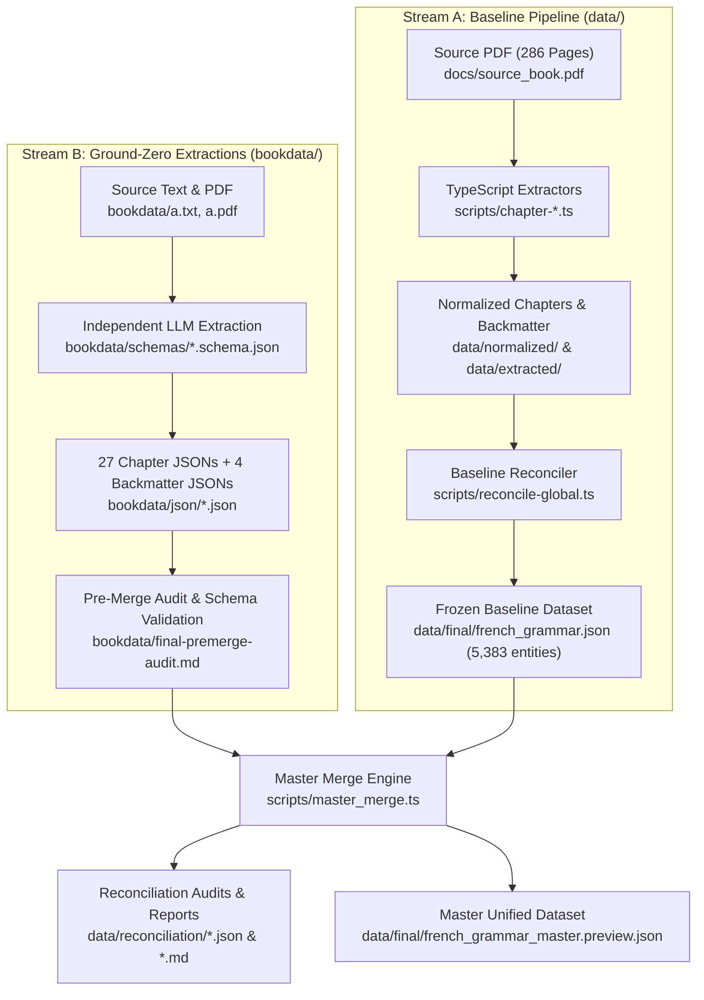

# Practice Makes Perfect: Complete French Grammar — Knowledge Base & Pipeline

A comprehensive, end-to-end repository for extracting, structuring, validating, enriching, and combining the complete content of the authoritative textbook **"Practice Makes Perfect: Complete French Grammar"** (Annie Heminway, McGraw-Hill) into a unified, fully relational French Revision Knowledge Base and Super-Dataset.

---

## 📌 Table of Contents
1. [Executive Summary & Current Project Situation](#-executive-summary--current-project-situation)
2. [Dual Data Streams Architecture & Master Merge](#-dual-data-streams-architecture--master-merge)
3. [Deep Dive into `bookdata/` (Ground-Zero Extractions)](#-deep-dive-into-bookdata-ground-zero-extractions)
   - [File Inventory & Descriptions](#file-inventory--descriptions)
   - [JSON Schema Specifications (`bookdata/schemas/`)](#json-schema-specifications-bookdataschemas)
   - [Chapter Coverage (100% Complete)](#chapter-coverage-100-complete)
4. [Exhaustive Codebase & File Location Map](#-exhaustive-codebase--file-location-map)
   - [Root Project & Configuration Files](#root-project--configuration-files)
   - [`bookdata/` — Ground-Zero Extraction Suite & Schemas](#bookdata--ground-zero-extraction-suite--schemas)
   - [`scripts/` — Pipeline Orchestration, Extraction & Master Merge Engine](#scripts--pipeline-orchestration-extraction--master-merge-engine)
   - [`scripts/enrichment/` — Semantic Enrichment Suite](#scriptsenrichment--semantic-enrichment-suite)
   - [`src/` — Core Dataset Engine, App Data Layer & UI Components](#src--core-dataset-engine-app-data-layer--ui-components)
   - [`data/` — Data Artifacts (Raw, Extracted, Normalized, Final)](#data--data-artifacts)
   - [`data/reconciliation/` — Master Merge Audits & Resolution Reports](#datareconciliation--master-merge-audits--resolution-reports)
   - [`data/reports/` — Pipeline Audits & QA Reports](#datareports--pipeline-audits--qa-reports)
   - [`docs/` — Source Materials & Specifications](#docs--source-materials--specifications)
   - [`app/` & `public/` — Next.js Application Routes & Static Assets](#app--public--nextjs-application-routes--static-assets)
   - [`scratch/` — Diagnostic & Analysis Scripts](#scratch--diagnostic--analysis-scripts)
   - [`ui/` — Design Prototypes & UI Mockups](#ui--design-prototypes--ui-mockups)
5. [Master Merge & Reconciliation Pipeline](#-master-merge--reconciliation-pipeline)
6. [Available npm & CLI Commands](#-available-npm--cli-commands)

---

## 🚀 Executive Summary & Current Project Situation

This repository houses tools and datasets for digitizing the complete textbook into an interconnected French grammar knowledge graph.

### Current State
1. **Baseline Legacy Pipeline (`data/` & `scripts/`)**:
   - An initial TypeScript pipeline extracted, normalized, and assembled all 27 chapters plus backmatter into [`data/final/french_grammar.json`](file:///Users/sukhjot/codes/book/data/final/french_grammar.json) (5,383 entities, zero broken relations).
2. **Ground-Zero Independent Extraction Suite (`bookdata/`)**:
   - **All 27 chapters (`1.json` to `27.json`)** plus **4 comprehensive backmatter datasets** (`answer_key.json`, `verb_table.json`, `English-Frenchglossary.json`, `French-Englishglossary.json`) have been extracted using independent ground-zero schemas in [`bookdata/schemas/`](file:///Users/sukhjot/codes/book/bookdata/schemas) and [`bookdata/instructions.txt`](file:///Users/sukhjot/codes/book/bookdata/instructions.txt).
   - Zero missing chapters: 100% coverage achieved.
3. **Master Merge & Reconciliation Engine (`scripts/master_merge.ts` & `data/reconciliation/`)**:
   - A deterministic master merge engine reconciles entities across both streams, performs ASCII slugification on all IDs, resolves dangling foreign keys, synthesizes missing global concept nodes, repairs OCR glossary errors, and compiles the master preview dataset [`data/final/french_grammar_master.preview.json`](file:///Users/sukhjot/codes/book/data/final/french_grammar_master.preview.json).

---

## 🔄 Dual Data Streams Architecture & Master Merge



---

## 📂 Deep Dive into `bookdata/` (Ground-Zero Extractions)

The `bookdata/` directory contains all assets for the schema-enforced independent extraction.

### File Inventory & Descriptions

| File / Folder | Purpose / Contents |
| :--- | :--- |
| [`bookdata/instructions.txt`](file:///Users/sukhjot/codes/book/bookdata/instructions.txt) | Master prompt instructions and monolithic Draft 2020-12 JSON Schema specification for ground-zero chapter extractions. |
| [`bookdata/schemas/`](file:///Users/sukhjot/codes/book/bookdata/schemas/) | Dedicated JSON Schema definitions for chapters, verb tables, glossaries, and answer keys. |
| [`bookdata/json/`](file:///Users/sukhjot/codes/book/bookdata/json/) | Contains **all 27 chapter extraction JSONs** (`1.json` to `27.json`) plus **4 structured backmatter JSONs**. |
| [`bookdata/final-premerge-audit.md`](file:///Users/sukhjot/codes/book/bookdata/final-premerge-audit.md) | Exhaustive pre-merge compliance and validation audit across all extracted chapter files. |
| [`bookdata/book backup.txt`](file:///Users/sukhjot/codes/book/bookdata/book%20backup.txt) | Complete textbook plain-text backup for offline reference. |
| [`bookdata/a.txt`](file:///Users/sukhjot/codes/book/bookdata/a.txt) | Page-delimited text extraction used for chapter parsing. |
| [`bookdata/a.pdf`](file:///Users/sukhjot/codes/book/bookdata/a.pdf) | High-resolution PDF source textbook. |

### JSON Schema Specifications (`bookdata/schemas/`)

- [`bookdata/schemas/deepseek-independent-chapter.schema.json`](file:///Users/sukhjot/codes/book/bookdata/schemas/deepseek-independent-chapter.schema.json) — Formal Draft 2020-12 JSON schema for chapter entities (concepts, rules, verbs, conjugations, expressions, vocabulary, examples, exercises, traps, attestations).
- [`bookdata/schemas/DEEPSEEK_ANSWER_KEY_SCHEMA.txt`](file:///Users/sukhjot/codes/book/bookdata/schemas/DEEPSEEK_ANSWER_KEY_SCHEMA.txt) — Schema specification for textbook exercise answer keys.
- [`bookdata/schemas/DEEPSEEK_GLOSSARY_SCHEMA.txt`](file:///Users/sukhjot/codes/book/bookdata/schemas/DEEPSEEK_GLOSSARY_SCHEMA.txt) — Schema specification for English-French and French-English glossaries.
- [`bookdata/schemas/DEEPSEEK_VERB_TABLES_SCHEMA.txt`](file:///Users/sukhjot/codes/book/bookdata/schemas/DEEPSEEK_VERB_TABLES_SCHEMA.txt) — Schema specification for comprehensive verb paradigm tables.

### Chapter Coverage (100% Complete)

All 27 textbook chapters are fully extracted in [`bookdata/json/`](file:///Users/sukhjot/codes/book/bookdata/json/):
- **Chapters 1–27**: [`1.json`](file:///Users/sukhjot/codes/book/bookdata/json/1.json) through [`27.json`](file:///Users/sukhjot/codes/book/bookdata/json/27.json) (100% complete, 0 missing chapters).
- **Structured Backmatter**:
  - [`answer_key.json`](file:///Users/sukhjot/codes/book/bookdata/json/answer_key.json) — Full textbook exercise answer keys.
  - [`verb_table.json`](file:///Users/sukhjot/codes/book/bookdata/json/verb_table.json) — Complete verb paradigm reference tables.
  - [`English-Frenchglossary.json`](file:///Users/sukhjot/codes/book/bookdata/json/English-Frenchglossary.json) — English-to-French lexical glossary.
  - [`French-Englishglossary.json`](file:///Users/sukhjot/codes/book/bookdata/json/French-Englishglossary.json) — French-to-English lexical glossary.

---

## 📂 Exhaustive Codebase & File Location Map

### Root Project & Configuration Files

| File | Purpose / Description |
| :--- | :--- |
| [`AGENTS.md`](file:///Users/sukhjot/codes/book/AGENTS.md) | Agent behavioral rules and Next.js specific framework instructions. |
| [`CLAUDE.md`](file:///Users/sukhjot/codes/book/CLAUDE.md) | Project architectural context, common development commands, and developer instructions. |
| [`README.md`](file:///Users/sukhjot/codes/book/README.md) | Authoritative master documentation, codebase map, and file inventory (this file). |
| [`package.json`](file:///Users/sukhjot/codes/book/package.json) | Node package definitions, dependencies, and npm pipeline scripts. |
| [`package-lock.json`](file:///Users/sukhjot/codes/book/package-lock.json) | Deterministic dependency tree lockfile. |
| [`tsconfig.json`](file:///Users/sukhjot/codes/book/tsconfig.json) | TypeScript compiler options, path aliases, and module resolutions. |
| [`tsconfig.tsbuildinfo`](file:///Users/sukhjot/codes/book/tsconfig.tsbuildinfo) | Incremental TypeScript build cache for fast compilation. |
| [`eslint.config.mjs`](file:///Users/sukhjot/codes/book/eslint.config.mjs) | ESLint flat configuration for code linting. |
| [`postcss.config.mjs`](file:///Users/sukhjot/codes/book/postcss.config.mjs) | PostCSS configuration for styling and TailwindCSS plugins. |
| [`next.config.ts`](file:///Users/sukhjot/codes/book/next.config.ts) | Next.js server configuration and build settings. |
| [`next-env.d.ts`](file:///Users/sukhjot/codes/book/next-env.d.ts) | Next.js TypeScript type declaration shim. |
| [`fix-pipeline.ts`](file:///Users/sukhjot/codes/book/fix-pipeline.ts) | Standalone repair and maintenance script for pipeline data passes. |
| [`plan-generator.js`](file:///Users/sukhjot/codes/book/plan-generator.js) | Utility script for generating structured execution plans. |
| [`stats.js`](file:///Users/sukhjot/codes/book/stats.js) | High-speed Node utility for tallying entity metrics across datasets. |
| [`test.js`](file:///Users/sukhjot/codes/book/test.js) & [`test2.js`](file:///Users/sukhjot/codes/book/test2.js) | Scratch testing scripts for ad-hoc validation and node diagnostics. |
| [`violations.md`](file:///Users/sukhjot/codes/book/violations.md) | Working log tracking schema violations during extraction. |
| [`premerge-fix-report.md`](file:///Users/sukhjot/codes/book/premerge-fix-report.md) | Audit report documenting pre-merge fixes applied to chapter JSONs. |

---

### `bookdata/` — Ground-Zero Extraction Suite & Schemas

| Path | Purpose / Description |
| :--- | :--- |
| [`bookdata/instructions.txt`](file:///Users/sukhjot/codes/book/bookdata/instructions.txt) | Core extraction prompt and schema specification. |
| [`bookdata/book backup.txt`](file:///Users/sukhjot/codes/book/bookdata/book%20backup.txt) | Plain-text reference transcript of the full book. |
| [`bookdata/a.txt`](file:///Users/sukhjot/codes/book/bookdata/a.txt) | Page-delimited text extraction. |
| [`bookdata/a.pdf`](file:///Users/sukhjot/codes/book/bookdata/a.pdf) | Source book PDF document. |
| [`bookdata/final-premerge-audit.md`](file:///Users/sukhjot/codes/book/bookdata/final-premerge-audit.md) | Pre-merge compliance audit of independent chapter extractions. |
| [`bookdata/schemas/deepseek-independent-chapter.schema.json`](file:///Users/sukhjot/codes/book/bookdata/schemas/deepseek-independent-chapter.schema.json) | Authoritative JSON schema for chapter extraction. |
| [`bookdata/schemas/DEEPSEEK_ANSWER_KEY_SCHEMA.txt`](file:///Users/sukhjot/codes/book/bookdata/schemas/DEEPSEEK_ANSWER_KEY_SCHEMA.txt) | Exercise answer key extraction schema. |
| [`bookdata/schemas/DEEPSEEK_GLOSSARY_SCHEMA.txt`](file:///Users/sukhjot/codes/book/bookdata/schemas/DEEPSEEK_GLOSSARY_SCHEMA.txt) | Glossary extraction schema specification. |
| [`bookdata/schemas/DEEPSEEK_VERB_TABLES_SCHEMA.txt`](file:///Users/sukhjot/codes/book/bookdata/schemas/DEEPSEEK_VERB_TABLES_SCHEMA.txt) | Verb paradigm table extraction schema specification. |
| [`bookdata/json/1.json`](file:///Users/sukhjot/codes/book/bookdata/json/1.json) … [`27.json`](file:///Users/sukhjot/codes/book/bookdata/json/27.json) | 27 independent chapter extraction JSON files covering all textbook content. |
| [`bookdata/json/answer_key.json`](file:///Users/sukhjot/codes/book/bookdata/json/answer_key.json) | Extracted answer key for all textbook exercise questions. |
| [`bookdata/json/verb_table.json`](file:///Users/sukhjot/codes/book/bookdata/json/verb_table.json) | Full conjugation tables extracted from the textbook appendix. |
| [`bookdata/json/English-Frenchglossary.json`](file:///Users/sukhjot/codes/book/bookdata/json/English-Frenchglossary.json) | Extracted English to French vocabulary glossary. |
| [`bookdata/json/French-Englishglossary.json`](file:///Users/sukhjot/codes/book/bookdata/json/French-Englishglossary.json) | Extracted French to English vocabulary glossary. |

---

### `scripts/` — Pipeline Orchestration, Extraction & Master Merge Engine

| Script | Purpose / Description |
| :--- | :--- |
| [`scripts/master_merge.ts`](file:///Users/sukhjot/codes/book/scripts/master_merge.ts) & [`.js`](file:///Users/sukhjot/codes/book/scripts/master_merge.js) | Primary master reconciliation engine: merges independent extractions, backmatter, and baseline data into a unified graph. |
| [`scripts/source-reconciled-targets.ts`](file:///Users/sukhjot/codes/book/scripts/source-reconciled-targets.ts) | Authoritative source mapping and target entity resolution engine. |
| [`scripts/test-master-semantic-repair.ts`](file:///Users/sukhjot/codes/book/scripts/test-master-semantic-repair.ts) | Verification and regression testing suite for master merge semantic repairs. |
| [`scripts/run-all.ts`](file:///Users/sukhjot/codes/book/scripts/run-all.ts) | Pipeline orchestrator that runs stages 1 through 5 sequentially. |
| [`scripts/build-final-dataset.ts`](file:///Users/sukhjot/codes/book/scripts/build-final-dataset.ts) | Direct builder and fast validator for baseline dataset compilation. |
| [`scripts/extract-pages.ts`](file:///Users/sukhjot/codes/book/scripts/extract-pages.ts) | Converts `docs/source_book.pdf` into 286 individual page JSON files. |
| [`scripts/extract-chapter.ts`](file:///Users/sukhjot/codes/book/scripts/extract-chapter.ts) | Extracts page slices for targeted chapter parsing. |
| [`scripts/parse-book.ts`](file:///Users/sukhjot/codes/book/scripts/parse-book.ts) | Multi-chapter extraction orchestrator for legacy extraction. |
| [`scripts/parse-backmatter.ts`](file:///Users/sukhjot/codes/book/scripts/parse-backmatter.ts) | Parses glossaries, verb tables, and answer key from PDF text. |
| [`scripts/normalize-chapter.ts`](file:///Users/sukhjot/codes/book/scripts/normalize-chapter.ts) | Typographical and linguistic normalizer (NFC, quotes, ligatures). |
| [`scripts/attach-answer-key.ts`](file:///Users/sukhjot/codes/book/scripts/attach-answer-key.ts) | Matches exercise questions to corresponding answer keys. |
| [`scripts/reconcile-global.ts`](file:///Users/sukhjot/codes/book/scripts/reconcile-global.ts) | Baseline global entity deduplicator and master graph assembler. |
| [`scripts/validate-dataset.ts`](file:///Users/sukhjot/codes/book/scripts/validate-dataset.ts) | Schema compliance and relational foreign key integrity validator. |
| [`scripts/check-coverage.ts`](file:///Users/sukhjot/codes/book/scripts/check-coverage.ts) | Quality assurance coverage calculator generating JSON/MD audit reports. |
| [`scripts/smoke-tests.ts`](file:///Users/sukhjot/codes/book/scripts/smoke-tests.ts) | 12 automated query, traversal, and integrity smoke tests. |
| [`scripts/check_json.py`](file:///Users/sukhjot/codes/book/scripts/check_json.py) | Python script for fast JSON syntax and structure verification. |
| [`scripts/fix_chapter_numbers.py`](file:///Users/sukhjot/codes/book/scripts/fix_chapter_numbers.py) | Python utility for normalizing chapter numbers across files. |
| [`scripts/test-data-regressions.ts`](file:///Users/sukhjot/codes/book/scripts/test-data-regressions.ts) | Tests for entity count or property regressions between builds. |
| [`scripts/test-exercise-expression-promotion.ts`](file:///Users/sukhjot/codes/book/scripts/test-exercise-expression-promotion.ts) | Test suite for exercise expression promotions. |
| [`scripts/test-fixture.ts`](file:///Users/sukhjot/codes/book/scripts/test-fixture.ts) | Test harness for verifying extraction fixtures. |
| [`scripts/chapter-types.ts`](file:///Users/sukhjot/codes/book/scripts/chapter-types.ts) | TypeScript type definitions for legacy chapter extractors. |
| [`scripts/chapter-01.ts`](file:///Users/sukhjot/codes/book/scripts/chapter-01.ts) … [`chapter-05.ts`](file:///Users/sukhjot/codes/book/scripts/chapter-05.ts) | Legacy individual chapter extractors. |
| [`scripts/chapters-06-to-10.ts`](file:///Users/sukhjot/codes/book/scripts/chapters-06-to-10.ts) | Grouped extractor for chapters 6 to 10. |
| [`scripts/chapters-11-to-18.ts`](file:///Users/sukhjot/codes/book/scripts/chapters-11-to-18.ts) | Grouped extractor for chapters 11 to 18. |
| [`scripts/chapters-19-to-27.ts`](file:///Users/sukhjot/codes/book/scripts/chapters-19-to-27.ts) | Grouped extractor for chapters 19 to 27. |

---

### `scripts/enrichment/` — Semantic Enrichment Suite

| Script | Purpose / Description |
| :--- | :--- |
| [`scripts/enrichment/enrich-exercises.ts`](file:///Users/sukhjot/codes/book/scripts/enrichment/enrich-exercises.ts) | Adds CEFR levels (A1–C2) and grammar concept tags to exercises. |
| [`scripts/enrichment/generate-conjugations.py`](file:///Users/sukhjot/codes/book/scripts/enrichment/generate-conjugations.py) | Generates complete French verb conjugation tables using Python. |
| [`scripts/enrichment/parse-conjugations-enhanced.ts`](file:///Users/sukhjot/codes/book/scripts/enrichment/parse-conjugations-enhanced.ts) | Advanced conjugation extractor with stem and ending decomposition. |
| [`scripts/enrichment/parse-examples-enhanced.ts`](file:///Users/sukhjot/codes/book/scripts/enrichment/parse-examples-enhanced.ts) | Extracts sentence examples with cloze test candidates and translations. |
| [`scripts/enrichment/parse-expressions-enhanced.ts`](file:///Users/sukhjot/codes/book/scripts/enrichment/parse-expressions-enhanced.ts) | Extracts idiomatic expressions, verbal constructions, and prepositions. |
| [`scripts/enrichment/parse-glossary-enhanced.ts`](file:///Users/sukhjot/codes/book/scripts/enrichment/parse-glossary-enhanced.ts) | Bidirectional glossary parser and linguistic tokenizer. |
| [`scripts/enrichment/promote-exercise-expressions.ts`](file:///Users/sukhjot/codes/book/scripts/enrichment/promote-exercise-expressions.ts) | Promotes idiomatic phrases discovered in exercises to primary expressions. |

---

### `src/` — Core Dataset Engine, App Data Layer & UI Components

#### `src/lib/dataset/` — Core Dataset Engine & Validation Graph
| File | Purpose / Description |
| :--- | :--- |
| [`src/lib/dataset/schemas.ts`](file:///Users/sukhjot/codes/book/src/lib/dataset/schemas.ts) & [`.js`](file:///Users/sukhjot/codes/book/src/lib/dataset/schemas.js) | Authoritative Zod schemas and TypeScript types defining all dataset entity shapes. |
| [`src/lib/dataset/ids.ts`](file:///Users/sukhjot/codes/book/src/lib/dataset/ids.ts) & [`.js`](file:///Users/sukhjot/codes/book/src/lib/dataset/ids.js) | Deterministic ID generators (`rule_*`, `verb_*`, `ex_*`, `vocab_*`). |
| [`src/lib/dataset/normalize.ts`](file:///Users/sukhjot/codes/book/src/lib/dataset/normalize.ts) | French Unicode NFC, apostrophe, quote, and ligature normalization. |
| [`src/lib/dataset/canonicalize.ts`](file:///Users/sukhjot/codes/book/src/lib/dataset/canonicalize.ts) & [`.js`](file:///Users/sukhjot/codes/book/src/lib/dataset/canonicalize.js) | Entity deduplication and canonical merge algorithms. |
| [`src/lib/dataset/relations.ts`](file:///Users/sukhjot/codes/book/src/lib/dataset/relations.ts) | Reverse relational index builders (e.g. `rule.verb_ids` <-> `verb.rule_ids`). |
| [`src/lib/dataset/validators.ts`](file:///Users/sukhjot/codes/book/src/lib/dataset/validators.ts) | Graph integrity, schema conformance, and foreign key validators. |
| [`src/lib/dataset/coverage.ts`](file:///Users/sukhjot/codes/book/src/lib/dataset/coverage.ts) | Coverage calculation and metrics generation module. |
| [`src/lib/dataset/load.ts`](file:///Users/sukhjot/codes/book/src/lib/dataset/load.ts) | High-level dataset loader and cached accessor. |

#### `src/lib/data/` — Application Data Access Layer
| File | Purpose / Description |
| :--- | :--- |
| [`src/lib/data/loader.ts`](file:///Users/sukhjot/codes/book/src/lib/data/loader.ts) | Server-side dataset loader for Next.js app pages and routes. |
| [`src/lib/data/search.ts`](file:///Users/sukhjot/codes/book/src/lib/data/search.ts) | In-memory search indexing and multi-entity querying engine. |
| [`src/lib/data/selectors.ts`](file:///Users/sukhjot/codes/book/src/lib/data/selectors.ts) | Query selectors for retrieving rules, verbs, conjugations, exercises, and examples. |

#### `src/components/` — React UI Component System
| File | Purpose / Description |
| :--- | :--- |
| [`src/components/layout/AppShell.tsx`](file:///Users/sukhjot/codes/book/src/components/layout/AppShell.tsx) | Responsive application shell with sidebar navigation and header. |
| [`src/components/search/CommandPalette.tsx`](file:///Users/sukhjot/codes/book/src/components/search/CommandPalette.tsx) | Spotlight-style Cmd+K search modal component. |
| [`src/components/ui/Badges.tsx`](file:///Users/sukhjot/codes/book/src/components/ui/Badges.tsx) | UI badges for CEFR levels, part-of-speech tags, and difficulty ratings. |
| [`src/components/ui/CrossLink.tsx`](file:///Users/sukhjot/codes/book/src/components/ui/CrossLink.tsx) | Interactive cross-link component for navigating between related entities. |

#### `src/styles/`
| File | Purpose / Description |
| :--- | :--- |
| [`src/styles/theme.css`](file:///Users/sukhjot/codes/book/src/styles/theme.css) | Custom CSS design tokens, color variables, and typography styles. |

---

### `data/` — Data Artifacts

| Directory / File | Purpose / Description |
| :--- | :--- |
| [`data/raw/pages-all.json`](file:///Users/sukhjot/codes/book/data/raw/pages-all.json) | Aggregated raw text extracted from all 286 PDF pages. |
| [`data/raw/chapter-map.json`](file:///Users/sukhjot/codes/book/data/raw/chapter-map.json) | Map of textbook chapters to page numbers. |
| `data/raw/pages/*.json` | Individual page JSON extractions (286 files). |
| [`data/extracted/chapters/`](file:///Users/sukhjot/codes/book/data/extracted/chapters/) | Stage 2 raw parsed chapters (`chapter-01.json` to `chapter-27.json`). |
| [`data/extracted/backmatter/`](file:///Users/sukhjot/codes/book/data/extracted/backmatter/) | Stage 2 parsed glossaries (`glossary-en-fr.json`, `glossary-fr-en.json`) and `verb-tables.json`. |
| [`data/normalized/chapters/`](file:///Users/sukhjot/codes/book/data/normalized/chapters/) | Stage 3 typographically normalized chapters (`chapter-01.json` to `chapter-27.json`). |
| [`data/normalized/global/concepts.json`](file:///Users/sukhjot/codes/book/data/normalized/global/concepts.json) | Global grammatical concept entities. |
| [`data/normalized/global/tenses.json`](file:///Users/sukhjot/codes/book/data/normalized/global/tenses.json) | Global French tense taxonomy definitions. |
| [`data/final/french_grammar.json`](file:///Users/sukhjot/codes/book/data/final/french_grammar.json) | Baseline frozen production dataset (5,383 entities, zero broken relations). |
| [`data/final/french_grammar_master.preview.json`](file:///Users/sukhjot/codes/book/data/final/french_grammar_master.preview.json) | Merged master super-dataset preview produced by the master merge engine. |

---

### `data/reconciliation/` — Master Merge Audits & Resolution Reports

| File | Purpose / Description |
| :--- | :--- |
| [`data/reconciliation/flash-final-prepromotion-audit.md`](file:///Users/sukhjot/codes/book/data/reconciliation/flash-final-prepromotion-audit.md) | Final pre-promotion audit verifying zero broken references and entity completeness. |
| [`data/reconciliation/final-promotion-audit.md`](file:///Users/sukhjot/codes/book/data/reconciliation/final-promotion-audit.md) | Pre-promotion verification audit report. |
| [`data/reconciliation/final-master-reaudit.md`](file:///Users/sukhjot/codes/book/data/reconciliation/final-master-reaudit.md) | Post-repair comprehensive re-audit report of the master dataset. |
| [`data/reconciliation/final-master-semantic-audit.md`](file:///Users/sukhjot/codes/book/data/reconciliation/final-master-semantic-audit.md) | Semantic integrity and entity classification audit report. |
| [`data/reconciliation/master-merge-summary.md`](file:///Users/sukhjot/codes/book/data/reconciliation/master-merge-summary.md) | Executive summary of the master merge execution and results. |
| [`data/reconciliation/master-semantic-repair-report.md`](file:///Users/sukhjot/codes/book/data/reconciliation/master-semantic-repair-report.md) | Documentation of semantic corrections applied during master merge. |
| [`data/reconciliation/master-second-semantic-repair-report.md`](file:///Users/sukhjot/codes/book/data/reconciliation/master-second-semantic-repair-report.md) | Second-pass semantic repair audit log. |
| [`data/reconciliation/master-final-targeted-repair-report.md`](file:///Users/sukhjot/codes/book/data/reconciliation/master-final-targeted-repair-report.md) | Targeted repairs report for individual foreign keys and references. |
| [`data/reconciliation/master-entity-counts.json`](file:///Users/sukhjot/codes/book/data/reconciliation/master-entity-counts.json) | Final entity count metrics for the master dataset. |
| [`data/reconciliation/master-input-counts.json`](file:///Users/sukhjot/codes/book/data/reconciliation/master-input-counts.json) | Counts of all entities ingested from source files. |
| [`data/reconciliation/master-input-disposition.json`](file:///Users/sukhjot/codes/book/data/reconciliation/master-input-disposition.json) | Exact disposition log (merged, kept, synthesized) for each input entity. |
| [`data/reconciliation/master-source-contribution.json`](file:///Users/sukhjot/codes/book/data/reconciliation/master-source-contribution.json) | Contribution tallies per source file. |
| [`data/reconciliation/master-id-map.json`](file:///Users/sukhjot/codes/book/data/reconciliation/master-id-map.json) | Mapping from raw source IDs to canonical master IDs. |
| [`data/reconciliation/master-idempotence-report.json`](file:///Users/sukhjot/codes/book/data/reconciliation/master-idempotence-report.json) | Idempotence audit verifying repeatability across merge executions. |
| [`data/reconciliation/master-conflicts.json`](file:///Users/sukhjot/codes/book/data/reconciliation/master-conflicts.json) | Documented resolutions for conflicting entity fields. |
| [`data/reconciliation/master-duplicate-audit.json`](file:///Users/sukhjot/codes/book/data/reconciliation/master-duplicate-audit.json) | Duplicate detection and resolution report. |
| [`data/reconciliation/master-normalization-collisions.json`](file:///Users/sukhjot/codes/book/data/reconciliation/master-normalization-collisions.json) | Tracking of string normalization collisions. |
| [`data/reconciliation/master-uncertain-matches.json`](file:///Users/sukhjot/codes/book/data/reconciliation/master-uncertain-matches.json) | Low-confidence entity match audit. |
| [`data/reconciliation/master-vocabulary-conflict-resolution.json`](file:///Users/sukhjot/codes/book/data/reconciliation/master-vocabulary-conflict-resolution.json) | Resolution log for polysemous vocabulary senses. |
| [`data/reconciliation/master-broken-reference-resolution.json`](file:///Users/sukhjot/codes/book/data/reconciliation/master-broken-reference-resolution.json) | Mappings and closures applied to dangling relational references. |
| [`data/reconciliation/master-final-relationship-resolution.json`](file:///Users/sukhjot/codes/book/data/reconciliation/master-final-relationship-resolution.json) | Full relationship graph resolution audit. |
| [`data/reconciliation/master-relationship-audit.json`](file:///Users/sukhjot/codes/book/data/reconciliation/master-relationship-audit.json) | Relational integrity validation report. |
| [`data/reconciliation/master-coverage-report.json`](file:///Users/sukhjot/codes/book/data/reconciliation/master-coverage-report.json) | Master dataset coverage statistics. |
| [`data/reconciliation/master-provenance-audit.json`](file:///Users/sukhjot/codes/book/data/reconciliation/master-provenance-audit.json) | Attestation and provenance verification across master entities. |
| [`data/reconciliation/master-reconciled-target-source-trace.json`](file:///Users/sukhjot/codes/book/data/reconciliation/master-reconciled-target-source-trace.json) | Traceability report linking master entities to original sources. |
| [`data/reconciliation/master-generated-global-entities.json`](file:///Users/sukhjot/codes/book/data/reconciliation/master-generated-global-entities.json) | Record of synthesized global nodes created to close graph gaps. |
| [`data/reconciliation/master-glossary-corruption-repairs.json`](file:///Users/sukhjot/codes/book/data/reconciliation/master-glossary-corruption-repairs.json) | Repairs applied to OCR or text corruptions in glossaries. |
| [`data/reconciliation/master-glossary-routing.json`](file:///Users/sukhjot/codes/book/data/reconciliation/master-glossary-routing.json) | Routing decision records for terms classified as vocabulary vs. expressions. |
| [`data/reconciliation/master-answer-key-corrections.json`](file:///Users/sukhjot/codes/book/data/reconciliation/master-answer-key-corrections.json) | Corrections applied to exercise answer alignments. |

---

### `data/reports/` — Pipeline Audits & QA Reports

| File | Purpose / Description |
| :--- | :--- |
| `data/reports/*.md` | 14 Markdown quality and audit reports (`dataset-freeze-check.md`, `exercise-collocation-final-fix.md`, `final-acceptance-audit.md`, `final-dataset-freeze-verification.md`, `final-repair-report.md`, `final-semantic-audit.md`, `forensic-final-audit.md`, `semantic-content-audit.md`, `semantic-enrichment-report.md`, `sol-audit-repair-report.md`, `sol-final-independent-audit.md`, `sol-final-recheck-repair.md`, `sol-final-recheck.md`, `targeted-final-fix-report.md`). |
| `data/reports/*.json` | 21 JSON diagnostic files (`ambiguities.json`, `broken-relations.json`, `conjugation-gaps.json`, `coverage-report.json`, `duplicate-report.json`, `exercise-coverage.json`, `exercise-expression-candidates.json`, `exercise-expression-promotion-fixture-audit.json`, `exercise-expression-promotion.json`, `exercise-reconciliation.json`, `extraction-summary.json`, `glossary-coverage.json`, `low-confidence-items.json`, `progress.json`, `remaining-other-entries.json`, `sol-reviewed-expression-approvals.json`, `unmatched-answers.json`, `unresolved-duplicates.json`, `unresolved-relations.json`, `validation-report.json`, `verb-coverage.json`, `vocabulary-gaps.json`). |

---

### `docs/` — Source Materials & Specifications

| File | Purpose / Description |
| :--- | :--- |
| [`docs/source_book.pdf`](file:///Users/sukhjot/codes/book/docs/source_book.pdf) | Authoritative source textbook PDF (286 pages). |
| [`docs/french_revision_super_dataset_spec.txt`](file:///Users/sukhjot/codes/book/docs/french_revision_super_dataset_spec.txt) | Original specification contract and data model definitions. |
| [`docs/GEMINI_BOOK_PARSING_TODO.txt`](file:///Users/sukhjot/codes/book/docs/GEMINI_BOOK_PARSING_TODO.txt) | Historical parsing roadmap and checklist. |

---

### `app/` & `public/` — Next.js Application Routes & Static Assets

| Path | Purpose / Description |
| :--- | :--- |
| [`app/layout.tsx`](file:///Users/sukhjot/codes/book/app/layout.tsx) & [`app/page.tsx`](file:///Users/sukhjot/codes/book/app/page.tsx) | Root application layout with AppShell wrapper and home dashboard view. |
| [`app/globals.css`](file:///Users/sukhjot/codes/book/app/globals.css) | Global stylesheet with Tailwind utilities and base theme tokens. |
| [`app/chapters/page.tsx`](file:///Users/sukhjot/codes/book/app/chapters/page.tsx) & `[id]/` | Chapter overview directory and individual chapter revision reading views. |
| [`app/grammar/page.tsx`](file:///Users/sukhjot/codes/book/app/grammar/page.tsx) & `[id]/` | Grammar rules browser and detailed rule view with linked examples. |
| [`app/verbs/page.tsx`](file:///Users/sukhjot/codes/book/app/verbs/page.tsx) & `[id]/` | French verbs library with full conjugation paradigm viewer. |
| [`app/tenses/page.tsx`](file:///Users/sukhjot/codes/book/app/tenses/page.tsx) & `[id]/` | French tense and mood library with formation and usage notes. |
| [`app/vocabulary/page.tsx`](file:///Users/sukhjot/codes/book/app/vocabulary/page.tsx) | Lexical vocabulary library and glossary explorer. |
| [`app/expressions/page.tsx`](file:///Users/sukhjot/codes/book/app/expressions/page.tsx) & `[id]/` | Idioms, verbal patterns, and preposition constructions explorer. |
| [`app/examples/page.tsx`](file:///Users/sukhjot/codes/book/app/examples/page.tsx) | Interactive explorer for contextual example sentences. |
| [`app/search/page.tsx`](file:///Users/sukhjot/codes/book/app/search/page.tsx) & [`app/api/search/`](file:///Users/sukhjot/codes/book/app/api/search) | Global search results view and search API endpoint. |
| [`public/`](file:///Users/sukhjot/codes/book/public/) | Static vector icons (`file.svg`, `globe.svg`, `next.svg`, `vercel.svg`, `window.svg`). |

---

### `scratch/` — Diagnostic & Analysis Scripts

| File | Purpose / Description |
| :--- | :--- |
| [`scratch/inspect-counts.js`](file:///Users/sukhjot/codes/book/scratch/inspect-counts.js) & [`scratch/inspect-counts-schema.js`](file:///Users/sukhjot/codes/book/scratch/inspect-counts-schema.js) | Quick scripts to count entities and validate schema compliance. |
| [`scratch/inspect-pipeline.ts`](file:///Users/sukhjot/codes/book/scratch/inspect-pipeline.ts) | Pipeline entity inspector and diagnostics. |
| [`scratch/inspect-glossary.ts`](file:///Users/sukhjot/codes/book/scratch/inspect-glossary.ts) | Inspects glossary tokens and sense structures. |
| [`scratch/inspect-tenses.js`](file:///Users/sukhjot/codes/book/scratch/inspect-tenses.js) | Inspects tense definitions and usage mappings. |
| [`scratch/rewrite_merge.ts`](file:///Users/sukhjot/codes/book/scratch/rewrite_merge.ts) | Experimental script for rewriting and merging entity blocks. |
| [`scratch/verb_counts.json`](file:///Users/sukhjot/codes/book/scratch/verb_counts.json) & [`verb-tables.json.bak`](file:///Users/sukhjot/codes/book/scratch/verb-tables.json.bak) | Temporary verb entity counts and backup files. |

---

### `ui/` — Design Prototypes & UI Mockups

| Directory | Purpose / Description |
| :--- | :--- |
| [`ui/stitch_l_atlas_de_fran_ais/`](file:///Users/sukhjot/codes/book/ui/stitch_l_atlas_de_fran_ais/) | High-fidelity design mockups and HTML prototypes for the French learning UI ("L'Atlas de Français"), including revision home, chapter details, grammar library, verbs library, search palette, and vocabulary views. |

---

## 🛠️ Master Merge & Reconciliation Pipeline

The dataset unification is driven by [`scripts/master_merge.ts`](file:///Users/sukhjot/codes/book/scripts/master_merge.ts) with target mappings defined in [`scripts/source-reconciled-targets.ts`](file:///Users/sukhjot/codes/book/scripts/source-reconciled-targets.ts):

1. **Ingestion & ID Slugification**: Ingests all 27 chapters and 4 backmatter files from `bookdata/json/`, applying deterministic ASCII slugification to entity IDs (`^[a-z0-9_]+$`).
2. **Entity Deduplication & Canonical Merging**:
   - Merges identical verbs, vocabulary items, and expressions across chapters while unioning attestations and conjugations.
   - Enforces schema enums (e.g. `auxiliary`: `'être'` -> `'etre'`).
3. **Glossary Routing & OCR Repair**:
   - Parses lexical terms and expressions from English-French and French-English glossaries.
   - Applies targeted fixes for text corruptions recorded in [`master-glossary-corruption-repairs.json`](file:///Users/sukhjot/codes/book/data/reconciliation/master-glossary-corruption-repairs.json).
4. **Relational Graph Closure**:
   - Synthesizes missing global concept nodes recorded in [`master-generated-global-entities.json`](file:///Users/sukhjot/codes/book/data/reconciliation/master-generated-global-entities.json).
   - Reconciles dangling foreign keys recorded in [`master-broken-reference-resolution.json`](file:///Users/sukhjot/codes/book/data/reconciliation/master-broken-reference-resolution.json).
5. **Master Preview Export & Validation**:
   - Exports unified graph to [`data/final/french_grammar_master.preview.json`](file:///Users/sukhjot/codes/book/data/final/french_grammar_master.preview.json).
   - Validates zero dangling foreign keys and outputs complete audit logs to [`data/reconciliation/`](file:///Users/sukhjot/codes/book/data/reconciliation/).

---

## ⌨️ Available npm & CLI Commands

```bash
# Run the complete legacy baseline pipeline
npm run data:all

# Master merge: reconcile bookdata/json with backmatter into unified master dataset
npx tsx scripts/master_merge.ts

# Run test verification for master merge semantic repairs
npx tsx scripts/test-master-semantic-repair.ts

# Extract raw pages from docs/source_book.pdf
npm run data:extract-pages

# Parse chapters 1 to 27 (baseline)
npm run data:parse

# Normalize French typography and linguistic tokens
npm run data:normalize

# Reconcile global entities and assemble baseline final dataset
npm run data:reconcile

# Build & validate dataset directly
npm run data:build

# Validate schema conformance and foreign key graph integrity
npm run data:validate

# Generate QA and coverage reports
npm run data:coverage

# Run automated smoke tests
npx tsx scripts/smoke-tests.ts

# Start Next.js web application
npm run dev

# Run TypeScript type check
npx tsc --noEmit
```
