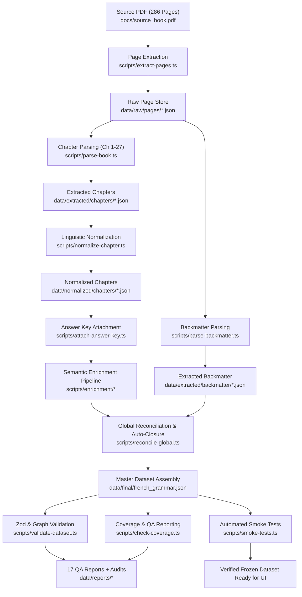

# Practice Makes Perfect: Complete French Grammar — Revision Super-Dataset

An end-to-end data extraction, semantic enrichment, normalization, relational canonicalization, and validation pipeline that transforms the authoritative book **"Practice Makes Perfect: Complete French Grammar"** (Annie Heminway, McGraw-Hill) into a rich, fully relational French Revision Super-Dataset.

---

## 📌 Table of Contents
1. [Overview & Project Status](#-overview--project-status)
2. [Dataset Metrics Summary](#-dataset-metrics-summary)
3. [Exhaustive Repository Structure](#-exhaustive-repository-structure)
4. [Data Pipeline Architecture & Execution Flow](#-data-pipeline-architecture--execution-flow)
5. [Codebase Breakdown](#-codebase-breakdown)
   - [`src/lib/dataset/` — Core Schema, IDs, Canonicalization & Validators](#srclibdataset--core-modules)
   - [`scripts/` — Pipeline Runners & Chapter Builders](#scripts--pipeline-runners--chapter-builders)
   - [`scripts/enrichment/` — Semantic Enrichment Suite](#scriptsenrichment--semantic-enrichment-suite)
   - [`data/` — Raw, Extracted, Normalized, Final & Reports](#data--data-artifacts)
   - [`docs/` — Source Book & Authoritative Specifications](#docs--documentation--specifications)
   - [`app/` & `public/` — Next.js Application](#app--public--web-application)
6. [Audit, Quality & QA Reports](#-audit-quality--qa-reports)
7. [Automated Smoke Tests & Verification](#-automated-smoke-tests--verification)
8. [Available npm & CLI Commands](#-available-npm--cli-commands)

---

## 🚀 Overview & Project Status

The data parsing, semantic enrichment, canonicalization, and validation pipeline is **100% complete, frozen, and verified**. All 27 chapters, along with extensive back matter (French–English glossary, English–French glossary, 101 verb conjugation tables, and comprehensive answer keys), have been extracted, enriched, normalized, canonicalized, and cross-referenced with **0 schema errors, 0 ID errors, and 0 broken relations**.

- **Authoritative Data Contract**: [`docs/french_revision_super_dataset_spec.txt`](file:///Users/sukhjot/codes/book/docs/french_revision_super_dataset_spec.txt)
- **Authoritative Execution Plan**: [`docs/GEMINI_BOOK_PARSING_TODO.txt`](file:///Users/sukhjot/codes/book/docs/GEMINI_BOOK_PARSING_TODO.txt)
- **Final Master Dataset**: [`data/final/french_grammar.json`](file:///Users/sukhjot/codes/book/data/final/french_grammar.json)
- **Latest Freeze Verification**: [`data/reports/dataset-freeze-check.md`](file:///Users/sukhjot/codes/book/data/reports/dataset-freeze-check.md)

---

## 📊 Dataset Metrics Summary

The master dataset (`data/final/french_grammar.json`) represents **5,383 validated entities** structured into a fully indexed relational graph:

| Entity Type | Total Count | Description |
|---|:---:|---|
| **Chapters** | **27** | All 27 textbook chapters covering French grammar from regular verbs to subjunctive and numbers |
| **Sections** | **80** | Granular thematic subsections across all 27 chapters |
| **Grammar Rules** | **93** | Deeply structured rules with formation, usage conditions, signals, exceptions, and common mistakes |
| **Tenses / Moods** | **16** | Global canonical tense & mood definitions with time markers, aspects, and descriptions |
| **Grammar Concepts** | **14** | High-level conceptual tags (negation, interrogation, agreement, pronoun order, etc.) |
| **Canonical Verbs** | **339** | Fully resolved verbs with groups, regularity, transitivity, auxiliaries, and attestations |
| **Conjugations** | **468** | Complete personal conjugation tables (indicative, subjunctive, conditional, imperative, participles) |
| **Expressions / Idioms** | **343** | High-value idiomatic patterns, verb constructions, fixed expressions, collocations, and connectors |
| **Vocabulary Items** | **1,023** | Lexical items (nouns with gender/article, adjectives, adverbs, prepositions) with English senses |
| **Example Sentences** | **979** | Bilingual curated sentences linked to rules, verbs, tenses, and cloze candidates |
| **Exercises** | **197** | Complete practice activities from every section of the book |
| **Exercise Questions** | **1,799** | Individual prompts with answer-key reconciliation (1,779 answers attached) |
| **Study Sets** | **4** | Built-in curated revision sets (Essential Verbs, High-Frequency Expressions, Tenses, Rules) |
| **Total Graph Entities** | **5,383** | **Zero broken relations, zero schema errors, 100% graph consistency** |

---

## 📂 Exhaustive Repository Structure

```
book/
├── AGENTS.md                             # Agent instructions & Next.js conventions
├── CLAUDE.md                             # Project instructions & command reference
├── README.md                             # Comprehensive project documentation (this file)
├── eslint.config.mjs                     # ESLint configuration
├── next-env.d.ts                         # Next.js TypeScript declarations
├── next.config.ts                        # Next.js build & runtime configuration
├── package.json                          # Dependencies, scripts, and project metadata
├── package-lock.json                     # Locked dependency tree
├── postcss.config.mjs                    # PostCSS / TailwindCSS styling configuration
├── tsconfig.json                         # TypeScript compiler configuration
├── tsconfig.tsbuildinfo                  # TypeScript build cache
│
├── app/                                  # Next.js App Router frontend
│   ├── favicon.ico                       # Web app favicon
│   ├── globals.css                       # Global styles & Tailwind CSS directives
│   ├── layout.tsx                        # Root layout component
│   └── page.tsx                          # Main landing page
│
├── public/                               # Static assets for the web application
│   ├── file.svg                          # File icon asset
│   ├── globe.svg                         # Globe icon asset
│   ├── next.svg                          # Next.js SVG brand asset
│   ├── vercel.svg                        # Vercel SVG brand asset
│   └── window.svg                        # Window icon asset
│
├── docs/                                 # Authoritative documentation & source materials
│   ├── GEMINI_BOOK_PARSING_TODO.txt      # Comprehensive step-by-step pipeline execution checklist
│   ├── french_revision_super_dataset_spec.txt # Authoritative dataset specification & schema contracts
│   └── source_book.pdf                   # Source book PDF ("Practice Makes Perfect: Complete French Grammar", 286 pages)
│
├── src/                                  # Application & pipeline source code
│   └── lib/
│       └── dataset/                      # Dataset engine, schema definitions & utilities
│           ├── canonicalize.ts           # Entity deduplication, canonical merge & frequency metrics
│           ├── coverage.ts               # Coverage metrics calculator & gap detector
│           ├── ids.ts                    # Deterministic, stable ID generators
│           ├── load.ts                   # Master dataset file loader utility
│           ├── normalize.ts              # French Unicode NFC, quote, ligature & whitespace normalizer
│           ├── relations.ts              # Reverse relational index builder
│           ├── schemas.ts                # Authoritative Zod schemas & TypeScript type definitions
│           └── validators.ts             # Schema validation, graph integrity & foreign key resolver
│
├── scripts/                              # Pipeline orchestration, extraction & validation scripts
│   ├── run-all.ts                        # Master 9-stage pipeline runner (end-to-end build)
│   ├── build-final-dataset.ts            # Fast final dataset assembler & validator
│   ├── extract-pages.ts                  # Raw page extraction from source PDF
│   ├── extract-chapter.ts                # Chapter extraction helper
│   ├── parse-book.ts                     # Chapter extraction orchestrator (Chapters 1 to 27)
│   ├── parse-backmatter.ts               # Backmatter parser (Glossaries, Verb Tables, Answer Keys)
│   ├── normalize-chapter.ts              # French typographical normalizer for chapter bundles
│   ├── attach-answer-key.ts              # Exercise prompt to answer key reconciler
│   ├── reconcile-global.ts               # Global canonicalization, auto-closure & master JSON assembly
│   ├── validate-dataset.ts               # Schema conformance & graph integrity validator
│   ├── check-coverage.ts                 # QA report generator (produces 17 JSON reports)
│   ├── smoke-tests.ts                    # 12 automated query & integrity smoke tests
│   ├── test-fixture.ts                   # Test fixture runner & sample validator
│   ├── check_json.py                     # Fast Python JSON integrity & syntax checker
│   ├── chapter-types.ts                  # Intermediate chapter extraction interfaces
│   │
│   ├── chapter-01.ts                     # Chapter 1 extractor (Present tense of regular -er verbs)
│   ├── chapter-02.ts                     # Chapter 2 extractor (Present tense of -ir and -re verbs)
│   ├── chapter-03.ts                     # Chapter 3 extractor (Passé composé)
│   ├── chapter-04.ts                     # Chapter 4 extractor (Imparfait)
│   ├── chapter-05.ts                     # Chapter 5 extractor (Futur simple & futur antérieur)
│   ├── chapters-06-to-10.ts              # Chapters 6-10 extractor (Conditionnel, Plus-que-parfait, Subjonctif, etc.)
│   ├── chapters-11-to-18.ts              # Chapters 11-18 extractor (Articles, Nouns, Adjectives, Pronouns, Prepositions)
│   ├── chapters-19-to-27.ts              # Chapters 19-27 extractor (Conjunctions, Adverbs, Negation, Interrogation, Numbers)
│   │
│   └── enrichment/                       # Advanced semantic enrichment pipeline
│       ├── enrich-exercises.ts           # Exercise context, difficulty & grammar tagging
│       ├── generate-conjugations.py      # Algorithmic full-paradigm conjugation table generator
│       ├── parse-conjugations-enhanced.ts# Enhanced conjugation extractor & table matcher
│       ├── parse-examples-enhanced.ts    # Deep sentence-level example extractor & cloze candidate parser
│       ├── parse-expressions-enhanced.ts # High-value idiomatic pattern & verb construction parser
│       └── parse-glossary-enhanced.ts    # Enhanced bidirectional glossary tokenization & POS classifier
│
└── data/                                 # Data storage across all pipeline lifecycle stages
    ├── raw/                              # Stage 1: Raw extracted text directly from PDF
    │   ├── chapter-map.json              # PDF page & printed page mappings for all 27 chapters
    │   ├── pages-all.json                # Single aggregated JSON file containing all 286 raw pages
    │   └── pages/                        # 286 individual raw page files (`page-001.json` - `page-286.json`)
    │
    ├── extracted/                        # Stage 2: Structured raw extractions
    │   ├── chapters/                     # 27 individual extracted chapters (`chapter-01.json` - `chapter-27.json`)
    │   └── backmatter/                   # Extracted backmatter elements
    │       ├── answer-key.json           # Comprehensive answer keys for Chapters 1-27
    │       ├── glossary-en-fr.json       # English-to-French glossary (915 entries)
    │       ├── glossary-fr-en.json       # French-to-English glossary (970 entries)
    │       └── verb-tables.json          # 101 Verb conjugation tables from appendix
    │
    ├── normalized/                       # Stage 3: French typography & linguistic normalization
    │   ├── chapters/                     # 27 normalized chapters (`chapter-01.json` - `chapter-27.json`)
    │   └── global/                       # Canonical foundational reference entities
    │       ├── concepts.json             # 14 Canonical grammatical concepts
    │       └── tenses.json               # 16 Canonical French tenses & moods
    │
    ├── final/                            # Stage 4: Authoritative production master dataset
    │   └── french_grammar.json           # Frozen, validated, self-contained SuperDatasetRoot (5,383 entities)
    │
    └── reports/                          # Stage 5: Audits, acceptance checks & QA validation reports
        ├── dataset-freeze-check.md       # Final freeze verification report (0 regressions, clean taxonomy)
        ├── final-acceptance-audit.md     # Forensic acceptance audit documentation
        ├── final-repair-report.md        # Deficiency repair & schema patch log
        ├── final-semantic-audit.md       # Semantic depth & entity relation audit
        ├── forensic-final-audit.md       # Deep forensic validation and integrity check
        ├── semantic-content-audit.md     # Linguistic accuracy & content richness assessment
        ├── semantic-enrichment-report.md # Enrichment metrics (conjugations, expressions, examples)
        ├── targeted-final-fix-report.md  # Targeted fix breakdown for glossary tokenization & POS tags
        ├── ambiguities.json              # Semantic ambiguity tracking log (count: 0)
        ├── broken-relations.json         # Foreign key reference mismatch log (count: 0)
        ├── conjugation-gaps.json         # Missing conjugation paradigm report (count: 0)
        ├── coverage-report.json          # Aggregate coverage statistics across all entity types
        ├── duplicate-report.json         # Candidate entity duplicate report (count: 0)
        ├── exercise-coverage.json        # Exercise prompt extraction ratios
        ├── exercise-reconciliation.json  # Exercise answer attachment reconciliation stats
        ├── extraction-summary.json       # Complete entity count & completion status summary
        ├── glossary-coverage.json        # Glossary extraction completeness ratio (1.0)
        ├── low-confidence-items.json     # Low confidence extraction items (count: 0)
        ├── progress.json                 # Comprehensive pipeline progression matrix
        ├── unmatched-answers.json        # Unmatched open-ended exercise items
        ├── unresolved-duplicates.json    # Unresolved duplicate entity log (count: 0)
        ├── unresolved-relations.json     # Unresolved graph relationship log (count: 0)
        ├── validation-report.json        # Full Zod validation output & metadata gap audit
        ├── verb-coverage.json            # Verb table coverage ratio (1.0)
        └── vocabulary-gaps.json          # Vocabulary metadata tracking
```

---

## 🔄 Data Pipeline Architecture & Execution Flow



### Pipeline Stages
1. **Raw Page Extraction**: Converts `docs/source_book.pdf` into 286 individual JSON pages with line numbers and bounding coordinates in `data/raw/pages/`.
2. **Grammar & Exercise Extraction**: Specialized chapter extractors (`chapter-01.ts` to `chapters-19-to-27.ts`) extract rules, formations, exceptions, verb paradigms, vocabulary, and exercises.
3. **Backmatter Extraction**: `scripts/parse-backmatter.ts` parses the 970-item French-English glossary, 915-item English-French glossary, 101 verb conjugation tables, and the complete answer key.
4. **French Normalization**: `src/lib/dataset/normalize.ts` standardizes Unicode (NFC), curly/straight apostrophes, ligatures (`œ`, `æ`), French quotation marks (`« »`), and whitespace.
5. **Answer Key Attachment**: Reconciles individual exercise questions with corresponding back-matter answer lines.
6. **Semantic Enrichment**: Parses 979 bilingual examples with cloze candidates, extracts 343 idiomatic expressions, expands full conjugation paradigms, and classifies lexical tokens.
7. **Canonicalization & Auto-Closure**: Merges cross-chapter entity duplicates, calculates unified learning priority/frequency scores, resolves referenced entities, and compiles `data/final/french_grammar.json`.
8. **Relational Graph Indexing**: Builds reverse indexes for bidirectional lookup across verbs, tenses, rules, concepts, and exercises.
9. **Verification & Audit Reporting**: Evaluates schema conformity, ID constraints, and graph references, generating 17 machine-readable reports and passing all 12 smoke tests.

---

## 💻 Codebase Breakdown

### `src/lib/dataset/` — Core Modules

- [`schemas.ts`](file:///Users/sukhjot/codes/book/src/lib/dataset/schemas.ts): Authoritative Zod validation schemas and TypeScript type exports for all entities:
  - `SuperDatasetRoot`, `BookMetadata`, `Chapter`, `Section`, `GrammarRule`, `Tense`, `GrammarConcept`
  - `Verb`, `Conjugation`, `Expression`, `Vocabulary`, `ExampleSentence`, `Exercise`, `ExerciseQuestion`, `StudySet`, `QualityReport`
  - Enums: `CEFRLevel`, `GrammarCategory`, `VerbGroup`, `VerbRegularity`, `Transitivity`, `AuxiliaryVerb`, `Mood`, `TenseEnum`, `ExpressionType`, `PartOfSpeech`, `Gender`, `DifficultyLevel`, `LearningPriority`
- [`ids.ts`](file:///Users/sukhjot/codes/book/src/lib/dataset/ids.ts): Deterministic ID generators (`makeVerbId`, `makeRuleId`, `makeChapterId`, `makeSectionId`, `makeExpressionId`, `makeVocabId`, `makeExampleId`, `makeExerciseId`, `makeStudySetId`, `makeBookId`) ensuring stable IDs across rebuilds.
- [`normalize.ts`](file:///Users/sukhjot/codes/book/src/lib/dataset/normalize.ts): French string normalization helper preserving accents (`é`, `è`, `ê`, `ë`, `à`, `ç`, `î`, `ï`, `ô`, `ù`, `û`), apostrophes, quotes, and ligatures.
- [`canonicalize.ts`](file:///Users/sukhjot/codes/book/src/lib/dataset/canonicalize.ts): Canonical merge utilities (`canonicalizeVerbs`, `canonicalizeVocabulary`, `canonicalizeExpressions`) that merge cross-chapter occurrences and recalculate frequency metrics without creating duplicates.
- [`relations.ts`](file:///Users/sukhjot/codes/book/src/lib/dataset/relations.ts): Fast reverse relation index builder (`buildReverseIndexes`) indexing items by verb, tense, rule, chapter, etc.
- [`validators.ts`](file:///Users/sukhjot/codes/book/src/lib/dataset/validators.ts): Core validator checking Zod compliance, ID prefix validity, entity uniqueness, and complete foreign key graph resolution.
- [`coverage.ts`](file:///Users/sukhjot/codes/book/src/lib/dataset/coverage.ts): Coverage evaluation helpers comparing extracted elements against source targets.
- [`load.ts`](file:///Users/sukhjot/codes/book/src/lib/dataset/load.ts): Synchronous and asynchronous loader utilities for accessing `french_grammar.json`.

---

### `scripts/` — Pipeline Runners & Chapter Builders

- [`run-all.ts`](file:///Users/sukhjot/codes/book/scripts/run-all.ts): Master script running the entire 9-stage pipeline from raw PDF extraction to smoke test execution.
- [`build-final-dataset.ts`](file:///Users/sukhjot/codes/book/scripts/build-final-dataset.ts): Fast standalone script to build, auto-close, and validate the final dataset.
- [`extract-pages.ts`](file:///Users/sukhjot/codes/book/scripts/extract-pages.ts): Extracts individual pages from `docs/source_book.pdf` using `pdf-parse`.
- [`extract-chapter.ts`](file:///Users/sukhjot/codes/book/scripts/extract-chapter.ts): Helper for chapter-specific extraction workflows.
- [`parse-book.ts`](file:///Users/sukhjot/codes/book/scripts/parse-book.ts): Runs all chapter extraction builders (1 to 27) and saves `data/extracted/chapters/`.
- [`parse-backmatter.ts`](file:///Users/sukhjot/codes/book/scripts/parse-backmatter.ts): Extracts FR-EN glossary, EN-FR glossary, verb tables, and answer key from back matter pages.
- [`normalize-chapter.ts`](file:///Users/sukhjot/codes/book/scripts/normalize-chapter.ts): Applies French normalization to all chapter bundles.
- [`attach-answer-key.ts`](file:///Users/sukhjot/codes/book/scripts/attach-answer-key.ts): Reconciles exercise questions with extracted back-matter answers.
- [`reconcile-global.ts`](file:///Users/sukhjot/codes/book/scripts/reconcile-global.ts): Merges all chapters + backmatter into canonical collections, auto-closes relations, and creates `data/final/french_grammar.json`.
- [`validate-dataset.ts`](file:///Users/sukhjot/codes/book/scripts/validate-dataset.ts): Runs schema and graph integrity checks.
- [`check-coverage.ts`](file:///Users/sukhjot/codes/book/scripts/check-coverage.ts): Generates all 17 QA, validation, and coverage reports in `data/reports/`.
- [`smoke-tests.ts`](file:///Users/sukhjot/codes/book/scripts/smoke-tests.ts): Executes the 12 automated smoke tests.
- [`test-fixture.ts`](file:///Users/sukhjot/codes/book/scripts/test-fixture.ts): Test fixture validator.
- [`check_json.py`](file:///Users/sukhjot/codes/book/scripts/check_json.py): Python JSON syntax and validity check utility.
- [`chapter-types.ts`](file:///Users/sukhjot/codes/book/scripts/chapter-types.ts): TypeScript interfaces for raw extracted chapter elements.
- **Chapter Extractors**:
  - `chapter-01.ts` (Regular -er verbs)
  - `chapter-02.ts` (-ir and -re verbs)
  - `chapter-03.ts` (Passé composé with avoir and être, Vandertramp)
  - `chapter-04.ts` (Imparfait formation and usage)
  - `chapter-05.ts` (Futur simple and futur antérieur)
  - `chapters-06-to-10.ts` (Plus-que-parfait, Conditionnel, Subjonctif, Pronominal verbs, Passé simple)
  - `chapters-11-to-18.ts` (Articles, Nouns, Adjectives, Pronouns, Relative Pronouns, Possessives, Demonstratives, Prepositions)
  - `chapters-19-to-27.ts` (Conjunctions, Adverbs, Negation, Interrogation, Passive Voice, Indirect Speech, Imperative, Infinitive, Numbers/Time)

---

### `scripts/enrichment/` — Semantic Enrichment Suite

- [`enrich-exercises.ts`](file:///Users/sukhjot/codes/book/scripts/enrichment/enrich-exercises.ts): Exercises enrichment script assigning CEFR levels, grammar tags, and hints to exercise prompts.
- [`generate-conjugations.py`](file:///Users/sukhjot/codes/book/scripts/enrichment/generate-conjugations.py): Python paradigm generator creating complete conjugation tables across all moods and tenses.
- [`parse-conjugations-enhanced.ts`](file:///Users/sukhjot/codes/book/scripts/enrichment/parse-conjugations-enhanced.ts): Deep verb conjugation table parser linking verb stems, endings, and irregular forms.
- [`parse-examples-enhanced.ts`](file:///Users/sukhjot/codes/book/scripts/enrichment/parse-examples-enhanced.ts): Sentence extractor identifying cloze deletion candidates, rule mappings, and English translations.
- [`parse-expressions-enhanced.ts`](file:///Users/sukhjot/codes/book/scripts/enrichment/parse-expressions-enhanced.ts): Idiom and prepositional construction parser identifying `verb_pattern`, `fixed_expression`, `connector`, and `collocation` types.
- [`parse-glossary-enhanced.ts`](file:///Users/sukhjot/codes/book/scripts/enrichment/parse-glossary-enhanced.ts): Enhanced glossary tokenizer separating multi-word idioms from single-word lexical items with parts of speech and noun genders.

---

### `data/` — Data Artifacts

- **`data/raw/`**: Contains raw extracted text from `source_book.pdf`, including `pages-all.json`, `chapter-map.json`, and 286 page JSON files.
- **`data/extracted/`**: Structured chapter JSON files (`chapters/chapter-01.json` to `chapter-27.json`) and backmatter components (`glossary-fr-en.json`, `glossary-en-fr.json`, `verb-tables.json`, `answer-key.json`).
- **`data/normalized/`**: Typographically cleaned chapter bundles and canonical global definitions (`tenses.json`, `concepts.json`).
- **`data/final/`**: Contains the master production dataset [`french_grammar.json`](file:///Users/sukhjot/codes/book/data/final/french_grammar.json).
- **`data/reports/`**: 8 markdown audit reports and 17 JSON quality reports detailing validation, coverage, duplicate resolution, and exercise reconciliation.

---

### `docs/` — Documentation & Specifications

- [`source_book.pdf`](file:///Users/sukhjot/codes/book/docs/source_book.pdf): Original 286-page PDF source book ("Practice Makes Perfect: Complete French Grammar").
- [`french_revision_super_dataset_spec.txt`](file:///Users/sukhjot/codes/book/docs/french_revision_super_dataset_spec.txt): Authoritative master specification detailing schemas, relations, entity ID conventions, normalization rules, and quality acceptance criteria.
- [`GEMINI_BOOK_PARSING_TODO.txt`](file:///Users/sukhjot/codes/book/docs/GEMINI_BOOK_PARSING_TODO.txt): Exhaustive, phase-by-phase implementation checklist and execution log.

---

### `app/` & `public/` — Web Application

- **Next.js 16 + React 19 + TailwindCSS 4**:
  - [`app/layout.tsx`](file:///Users/sukhjot/codes/book/app/layout.tsx): Root layout with metadata and font configurations.
  - [`app/page.tsx`](file:///Users/sukhjot/codes/book/app/page.tsx): Main interactive landing page for browsing grammar rules, conjugations, vocabulary, and exercises.
  - [`app/globals.css`](file:///Users/sukhjot/codes/book/app/globals.css): Global Tailwind CSS styles and theme variables.
  - [`public/`](file:///Users/sukhjot/codes/book/public/): Static SVG assets (`file.svg`, `globe.svg`, `next.svg`, `vercel.svg`, `window.svg`).

---

## 📋 Audit, Quality & QA Reports

The `data/reports/` directory contains comprehensive audit documentation demonstrating data completeness and zero-defect graph integrity:

### Forensic & Semantic Markdown Reports
1. [`dataset-freeze-check.md`](file:///Users/sukhjot/codes/book/data/reports/dataset-freeze-check.md): Confirms clean taxonomy redistribution (+163 vocabulary items, -173 expression cleanup), multi-word expression preservation, and dataset freeze.
2. [`final-acceptance-audit.md`](file:///Users/sukhjot/codes/book/data/reports/final-acceptance-audit.md): Complete forensic acceptance check against all requirements in `docs/french_revision_super_dataset_spec.txt`.
3. [`final-repair-report.md`](file:///Users/sukhjot/codes/book/data/reports/final-repair-report.md): Summary of defect repairs, missing relation patches, and rule cross-linking.
4. [`final-semantic-audit.md`](file:///Users/sukhjot/codes/book/data/reports/final-semantic-audit.md): Deep evaluation of semantic richness, cloze candidates, and tense markers.
5. [`forensic-final-audit.md`](file:///Users/sukhjot/codes/book/data/reports/forensic-final-audit.md): Forensic graph analysis across all 27 chapters.
6. [`semantic-content-audit.md`](file:///Users/sukhjot/codes/book/data/reports/semantic-content-audit.md): Audit of linguistic rules, usage conditions, and common mistakes.
7. [`semantic-enrichment-report.md`](file:///Users/sukhjot/codes/book/data/reports/semantic-enrichment-report.md): Documentation of semantic enrichment algorithms and yields.
8. [`targeted-final-fix-report.md`](file:///Users/sukhjot/codes/book/data/reports/targeted-final-fix-report.md): Analysis of targeted fixes applied to glossary tokenization and expression classification.

### Machine-Readable JSON Quality Reports
- `extraction-summary.json`: Top-level entity metrics and `"status": "complete"`.
- `validation-report.json`: Zod validation log showing 0 schema errors and 0 broken foreign keys.
- `coverage-report.json`: Aggregate entity coverage analysis.
- `broken-relations.json` & `unresolved-relations.json`: Zero broken relation references.
- `duplicate-report.json` & `unresolved-duplicates.json`: Zero unresolved duplicate entities.
- `low-confidence-items.json` & `ambiguities.json`: Zero low-confidence flags or extraction ambiguities.
- `exercise-coverage.json` & `exercise-reconciliation.json`: Exercise answer attachment stats (1,779 answers matched).
- `glossary-coverage.json` & `verb-coverage.json`: 100% glossary (1,885 items) and verb table (101 tables) coverage.
- `conjugation-gaps.json` & `vocabulary-gaps.json`: Conjugation and vocabulary metadata reports.

---

## 🧪 Automated Smoke Tests & Verification

The test suite in [`scripts/smoke-tests.ts`](file:///Users/sukhjot/codes/book/scripts/smoke-tests.ts) verifies dataset queryability, entity relationships, and schema conformance:

```bash
npx tsx scripts/smoke-tests.ts
```

### Test Suite Results:
1. ✅ **Root Schema**: Validates root object against `SuperDatasetRootSchema` across all 27 chapters.
2. ✅ **Present Indicative Query**: Retrieves 60 grammar rules linked to the present indicative tense.
3. ✅ **Être Auxiliary Verbs**: Retrieves 22 verbs conjugated with *être* (Vandertramp and pronominals).
4. ✅ **Irregular Past Participles**: Retrieves 75 irregular verbs with explicit irregular past participles.
5. ✅ **Avoir Idioms**: Retrieves 35 idiomatic expressions containing *avoir* (`avoir faim`, `avoir besoin de`, `avoir envie de`, etc.).
6. ✅ **Chapter 7 Exercises**: Retrieves all 10 exercises and 86 questions with attached answer keys in Chapter 7.
7. ✅ **Glossary Lookup**: Confirms lookup for expressions like `par cœur` in the lexical repository.
8. ✅ **Savoir vs Connaître Contrast**: Retrieves `rule_savoir_versus_connaitre` with distinction rules.
9. ✅ **Depuis Present Rule**: Retrieves `rule_depuis_with_present_tense` (*depuis*, *il y a... que*, *ça fait... que*).
10. ✅ **Il s'agit de Impersonal Rule**: Retrieves `rule_il_s_agit_de_impersonal_construction`.
11. ✅ **DR & MRS VANDERTRAMP Rule**: Retrieves `rule_vandertramp_verbs_with_etre`.
12. ✅ **Zero Broken Relations**: Verifies exactly **0 broken foreign key IDs** across all 5,383 entities.

---

## ⌨️ Available npm & CLI Commands

```bash
# Run the complete end-to-end extraction, normalization, enrichment & validation pipeline
npm run data:all

# Extract PDF pages from docs/source_book.pdf
npm run data:extract-pages

# Parse all 27 chapters into structured JSON
npm run data:parse

# Normalize French typography and linguistic tokens
npm run data:normalize

# Reconcile global entities and assemble data/final/french_grammar.json
npm run data:reconcile

# Build & auto-close the final dataset directly
npm run data:build

# Validate schema conformance and foreign key graph integrity
npm run data:validate

# Generate all 17 QA, validation, and coverage reports in data/reports/
npm run data:coverage

# Run the 12 automated smoke tests
npx tsx scripts/smoke-tests.ts

# Run Next.js local development server
npm run dev

# Run TypeScript type check
npx tsc --noEmit
```
