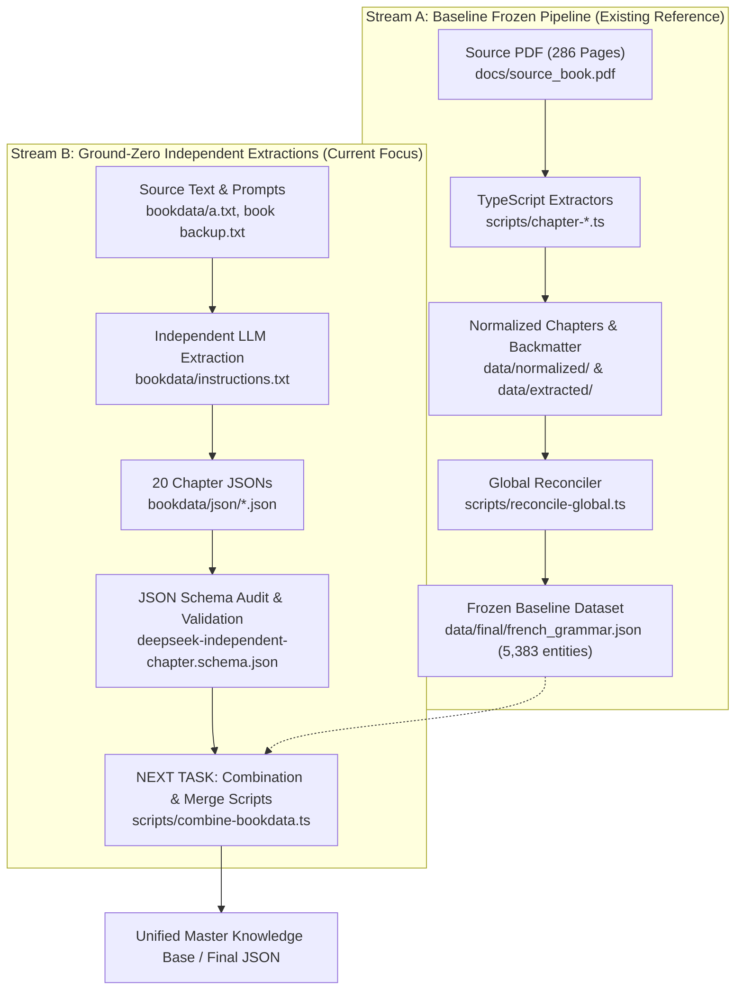

# Practice Makes Perfect: Complete French Grammar — Knowledge Base & Pipeline

A comprehensive, end-to-end repository for extracting, structuring, validating, enriching, and combining the complete content of the authoritative textbook **"Practice Makes Perfect: Complete French Grammar"** (Annie Heminway, McGraw-Hill) into a unified, fully relational French Revision Knowledge Base and Super-Dataset.

---

## 📌 Table of Contents
1. [Executive Summary & Current Project Situation](#-executive-summary--current-project-situation)
2. [Dual Data Streams Architecture](#-dual-data-streams-architecture)
3. [Deep Dive into `bookdata/` (Ground-Zero Extractions)](#-deep-dive-into-bookdata-ground-zero-extractions)
   - [File Inventory & Descriptions](#file-inventory--descriptions)
   - [JSON Schema Specification (`instructions.txt`)](#json-schema-specification-instructionstxt)
   - [Chapter Coverage & Missing Chapters](#chapter-coverage--missing-chapters)
   - [Entity Metrics Matrix (All 20 JSON Files)](#entity-metrics-matrix-all-20-json-files)
   - [Audit & Validation Report of `bookdata/json/*.json`](#audit--validation-report-of-bookdatajsonjson)
4. [Exhaustive Codebase & Folder Map](#-exhaustive-codebase--folder-map)
   - [`bookdata/` — Independent Extraction Suite](#bookdata--independent-extraction-suite)
   - [`src/lib/dataset/` — Core TypeScript Schema, IDs, Canonicalization & Validators](#srclibdataset--core-typescript-modules)
   - [`scripts/` — Pipeline Runners & Extractors](#scripts--pipeline-runners--extractors)
   - [`scripts/enrichment/` — Semantic Enrichment Suite](#scriptsenrichment--semantic-enrichment-suite)
   - [`data/` — Baseline Data Artifacts (Raw, Extracted, Normalized, Final, Reports)](#data--baseline-data-artifacts)
   - [`docs/` — Source Materials & Historical Specifications](#docs--source-materials--historical-specifications)
   - [`app/` & `public/` — Next.js Application](#app--public--nextjs-application)
5. [Blueprint & Instructions for Next AI Session (Data Combination Phase)](#-blueprint--instructions-for-next-ai-session-data-combination-phase)
   - [Objective](#objective)
   - [Key Integration Steps](#key-integration-steps)
   - [Handling Data Nuances & Cross-References](#handling-data-nuances--cross-references)
6. [Available npm & CLI Commands](#-available-npm--cli-commands)

---

## 🚀 Executive Summary & Current Project Situation

This repository houses tools and datasets for digitizing French grammar into a deeply interconnected knowledge graph.

### Current State
1. **Baseline Legacy Pipeline (`data/` & `scripts/`)**:
   - An end-to-end TypeScript pipeline previously extracted, normalized, and assembled all 27 chapters plus backmatter into [`data/final/french_grammar.json`](file:///Users/sukhjot/codes/book/data/final/french_grammar.json) (5,383 entities, zero broken relations).
2. **Ground-Zero Independent Extraction Suite (`bookdata/`)**:
   - A new, highly granular, schema-enforced extraction has been conducted using an independent ground-zero model declared in [`bookdata/instructions.txt`](file:///Users/sukhjot/codes/book/bookdata/instructions.txt).
   - **20 chapter files** have been extracted into [`bookdata/json/`](file:///Users/sukhjot/codes/book/bookdata/json) (`1.json` through `18.json`, `21.json`, `22.json`).
   - The JSON files contain over **3,100 extracted entities** (rules, conjugations, expressions, vocabulary, examples, exercises, common traps, and attestations).
3. **Next Phase Goal**:
   - Write automated scripts to clean, reconcile, and combine the rich chapter data from `bookdata/json/` (along with remaining chapters) into the final production dataset.

---

## 🔄 Dual Data Streams Architecture



---

## 📂 Deep Dive into `bookdata/` (Ground-Zero Extractions)

The `bookdata/` directory contains all assets for the ground-zero independent extraction.

### File Inventory & Descriptions

| File / Folder | Purpose / Contents |
| :--- | :--- |
| [`bookdata/instructions.txt`](file:///Users/sukhjot/codes/book/bookdata/instructions.txt) | Contains the **authoritative JSON Schema** (`deepseek-independent-chapter.schema.json`, lines 1–1788) followed by the extraction instructions and ground-zero prompting rules (lines 1789–2550). |
| [`bookdata/json/`](file:///Users/sukhjot/codes/book/bookdata/json/) | Contains 20 chapter extraction JSON files (`1.json` to `18.json`, `21.json`, `22.json`). |
| [`bookdata/book backup.txt`](file:///Users/sukhjot/codes/book/bookdata/book%20backup.txt) | Complete plain-text backup of the textbook content. |
| [`bookdata/a.txt`](file:///Users/sukhjot/codes/book/bookdata/a.txt) | Raw page-marked text extract used for ongoing chapter extractions. |
| [`bookdata/a.pdf`](file:///Users/sukhjot/codes/book/bookdata/a.pdf) | Original source book PDF document. |

---

### JSON Schema Specification (`instructions.txt`)

The JSON Schema in `bookdata/instructions.txt` enforces strict typing, `additionalProperties: false`, and exhaustive attestation tracking.

#### Top-Level Document Structure:
- `schema_version`: Must be `"1.0.0"`
- `extraction_mode`: Must be `"independent_ground_zero"`
- `chapter`: Object of type `chapterMeta` (`id`, `chapter_number`, `chapter_title`, `source_pages`, `notes`)
- `sections`: Array of `section` items
- `concepts`: Array of `concept` items
- `grammar_rules`: Array of `grammarRule` items
- `verbs`: Array of `verb` items
- `conjugations`: Array of `conjugation` items
- `expressions`: Array of `expression` items
- `vocabulary`: Array of `vocabulary` items
- `examples`: Array of `example` items
- `exercises`: Array of `exercise` items (with nested `questions` and `answer_sources`)
- `exceptions_and_traps`: Array of `exceptionTrap` items
- `uncertain_candidates`: Array of `uncertainCandidate` items

#### Key Sub-Entity Types (`$defs`):
- **`attestation`**: Strict provenance mapping every entity to `chapter_number`, `section_id`, `section_title`, `page_printed`, `page_pdf`, `context_type` (explanation, example, exercise, table, etc.), `exercise_id`, `question_number`, and `source_text`.
- **`origin`**: Metadata tracking `source_type` (`book` or `derived_from_book`), `created_by`, and `derived_from_ids`.
- **`study`**: Learning metadata with `learning_priority` (core, high, medium, low), `usefulness` (1–5), `difficulty` (1–5), and `frequency_note`.
- **`grammarRule`**: Comprehensive rule object containing formation, usage, restrictions, conditions, signal words, exceptions, agreement rules, word order, negative/interrogative/affirmative forms, transformations, traps, and linked entity IDs.
- **`verb`**: Infinitive, verb group (1, 2, 3), regularity, pronominal flag, transitivity enum array, auxiliary (`avoir`, `etre`, `both`), participles, important stems, and linked IDs.
- **`conjugation`**: Verb forms across persons (`je`, `tu`, `il_elle_on`, `nous`, `vous`, `ils_elles`, imperatives, participles), stems, and endings.
- **`expression`**: Idioms, verb patterns, connectors, and collocations with `pattern_slots`, `complement_structure`, prepositions, and collocation strength.
- **`vocabulary`**: Lexical entries with part of speech, gender, article, plural, variant forms, and senses.
- **`exercise`** & **`exerciseQuestion`**: Exercise prompts, instructions, open-ended flag, and reconciled answer keys with exact page sources.
- **`exceptionTrap`**: Common mistakes, confusion traps, correct forms, and incorrect forms.

---

### Chapter Coverage & Missing Chapters

- **Extracted Chapters Present (20 files)**: Chapters 1, 2, 3, 4, 5, 6, 7, 8, 9, 10, 11, 12, 13, 14, 15, 16, 17, 18, 21, 22.
- **Missing Chapters (7 files)**:
  - Chapter 19: Conjunctions
  - Chapter 20: Adverbs of Manner and Degree
  - Chapter 23: Negative Words and Phrases
  - Chapter 24: Interrogative Words and Expressions
  - Chapter 25: The Passive Voice
  - Chapter 26: Indirect Speech
  - Chapter 27: The Imperative and Infinitive

---

### Entity Metrics Matrix (All 20 JSON Files)

| File | Ch # | Sections | Rules | Verbs | Conj | Expressions | Vocab | Examples | Exercises | Traps | Uncertain |
| :--- | :---: | :---: | :---: | :---: | :---: | :---: | :---: | :---: | :---: | :---: | :---: |
| [1.json](file:///Users/sukhjot/codes/book/bookdata/json/1.json) | 1 | 12 | 14 | 113 | 7 | 8 | 20 | 52 | 10 | 5 | 3 |
| [2.json](file:///Users/sukhjot/codes/book/bookdata/json/2.json) | 2 | 9 | 10 | 62 | 62 | 15 | 19 | 33 | 11 | 3 | 0 |
| [3.json](file:///Users/sukhjot/codes/book/bookdata/json/3.json) | 3 | 8 | 10 | 17 | 17 | 26 | 33 | 26 | 11 | 3 | 0 |
| [4.json](file:///Users/sukhjot/codes/book/bookdata/json/4.json) | 4 | 8 | 12 | 12 | 4 | 40 | 23 | 67 | 9 | 5 | 0 |
| [5.json](file:///Users/sukhjot/codes/book/bookdata/json/5.json) | 5 | 5 | 7 | 17 | 3 | 13 | 7 | 30 | 5 | 1 | 1 |
| [6.json](file:///Users/sukhjot/codes/book/bookdata/json/6.json) | 6 | 6 | 10 | 45 | 9 | 45 | 21 | 28 | 6 | 0 | 0 |
| [7.json](file:///Users/sukhjot/codes/book/bookdata/json/7.json) | 7 | 7 | 12 | 46 | 2 | 31 | 31 | 57 | 10 | 5 | 0 |
| [8.json](file:///Users/sukhjot/codes/book/bookdata/json/8.json) | 8 | 10 | 10 | 62 | 2 | 16 | 46 | 45 | 7 | 4 | 0 |
| [9.json](file:///Users/sukhjot/codes/book/bookdata/json/9.json) | 9 | 4 | 15 | 45 | 33 | 8 | 11 | 46 | 8 | 4 | 0 |
| [10.json](file:///Users/sukhjot/codes/book/bookdata/json/10.json) | 10 | 9 | 6 | 38 | 2 | 15 | 22 | 20 | 6 | 2 | 0 |
| [11.json](file:///Users/sukhjot/codes/book/bookdata/json/11.json) | 11 | 5 | 11 | 26 | 4 | 19 | 58 | 46 | 10 | 3 | 1 |
| [12.json](file:///Users/sukhjot/codes/book/bookdata/json/12.json) | 12 | 4 | 8 | 3 | 7 | 20 | 37 | 24 | 6 | 5 | 1 |
| [13.json](file:///Users/sukhjot/codes/book/bookdata/json/13.json) | 13 | 10 | 16 | 25 | 12 | 55 | 17 | 51 | 9 | 3 | 0 |
| [14.json](file:///Users/sukhjot/codes/book/bookdata/json/14.json) | 14 | 15 | 16 | 71 | 0 | 10 | 1 | 65 | 7 | 6 | 0 |
| [15.json](file:///Users/sukhjot/codes/book/bookdata/json/15.json) | 15 | 3 | 11 | 59 | 14 | 16 | 41 | 29 | 3 | 5 | 0 |
| [16.json](file:///Users/sukhjot/codes/book/bookdata/json/16.json) | 16 | 10 | 5 | 53 | 47 | 6 | 37 | 8 | 3 | 2 | 3 |
| [17.json](file:///Users/sukhjot/codes/book/bookdata/json/17.json) | 17 | 9 | 8 | 43 | 6 | 11 | 24 | 34 | 3 | 4 | 0 |
| [18.json](file:///Users/sukhjot/codes/book/bookdata/json/18.json) | 18 | 11 | 6 | 25 | 0 | 17 | 21 | 19 | 4 | 0 | 1 |
| [21.json](file:///Users/sukhjot/codes/book/bookdata/json/21.json) | 21 | 8 | 13 | 17 | 0 | 19 | 3 | 2 | 1 | 2 | 0 |
| [22.json](file:///Users/sukhjot/codes/book/bookdata/json/22.json) | 22 | 5 | 15 | 0 | 0 | 0 | 52 | 91 | 7 | 6 | 0 |
| **TOTAL** | **20** | **158** | **215** | **779** | **231** | **390** | **524** | **773** | **136** | **68** | **10** |

---

### Audit & Validation Report of `bookdata/json/*.json`

A complete automated validation of all 20 JSON files against the `bookdata/instructions.txt` schema reveals:

#### 1. Extra Fields Check
* **Result**: **0 extra fields found across all 20 JSON files**.
* All files strictly adhere to the schema's property names and `additionalProperties: false` rules. No undocumented or unexpected keys are present in any object.

#### 2. File-by-File Compliance Table

| File | Extra Fields | Schema Violations | Status |
| :--- | :---: | :---: | :--- |
| [1.json](file:///Users/sukhjot/codes/book/bookdata/json/1.json) | 0 | 12 violations | Issues Found |
| [2.json](file:///Users/sukhjot/codes/book/bookdata/json/2.json) | 0 | 44 violations | Issues Found |
| [3.json](file:///Users/sukhjot/codes/book/bookdata/json/3.json) | 0 | 3 violations | Issues Found |
| [4.json](file:///Users/sukhjot/codes/book/bookdata/json/4.json) | 0 | 5 violations | Issues Found |
| [5.json](file:///Users/sukhjot/codes/book/bookdata/json/5.json) | 0 | 1 violation | Issues Found |
| [6.json](file:///Users/sukhjot/codes/book/bookdata/json/6.json) | 0 | 10 violations | Issues Found |
| [7.json](file:///Users/sukhjot/codes/book/bookdata/json/7.json) | 0 | 5 violations | Issues Found |
| [8.json](file:///Users/sukhjot/codes/book/bookdata/json/8.json) | 0 | 2 violations | Issues Found |
| [9.json](file:///Users/sukhjot/codes/book/bookdata/json/9.json) | 0 | 2 violations | Issues Found |
| [10.json](file:///Users/sukhjot/codes/book/bookdata/json/10.json) | 0 | 6 violations | Issues Found |
| [11.json](file:///Users/sukhjot/codes/book/bookdata/json/11.json) | 0 | 3 violations | Issues Found |
| [12.json](file:///Users/sukhjot/codes/book/bookdata/json/12.json) | 0 | 9 violations | Issues Found |
| [13.json](file:///Users/sukhjot/codes/book/bookdata/json/13.json) | 0 | 50 violations | Issues Found |
| [14.json](file:///Users/sukhjot/codes/book/bookdata/json/14.json) | 0 | 0 violations | **100% CLEAN** |
| [15.json](file:///Users/sukhjot/codes/book/bookdata/json/15.json) | 0 | 1 violation | Issues Found |
| [16.json](file:///Users/sukhjot/codes/book/bookdata/json/16.json) | 0 | 8 violations | Issues Found |
| [17.json](file:///Users/sukhjot/codes/book/bookdata/json/17.json) | 0 | 0 violations | **100% CLEAN** |
| [18.json](file:///Users/sukhjot/codes/book/bookdata/json/18.json) | 0 | 0 violations | **100% CLEAN** |
| [21.json](file:///Users/sukhjot/codes/book/bookdata/json/21.json) | 0 | 16 violations | Issues Found |
| [22.json](file:///Users/sukhjot/codes/book/bookdata/json/22.json) | 0 | 19 violations | Issues Found |

#### 3. Categories of Model Violations Found

##### A. Invalid Enum Values
* **Auxiliary Verb Spelling (`auxiliary`)**:
  - Found: `'être'` (with circumflex) instead of ASCII `'etre'`.
  - Allowed by schema: `['avoir', 'etre', 'both', 'none', 'unknown', null]`
  - *Affected files*: `1.json`, `16.json`, `21.json`.
* **Verb Transitivity (`transitivity`)**:
  - Found: `'impersonal'`, `'auxiliary'`, `'modal'`.
  - Allowed by schema: `['transitive', 'intransitive', 'ditransitive', 'copular', 'unknown']`
  - *Affected files*: `3.json`, `7.json`, `9.json`.
* **Expression Type (`expression_type`)**:
  - Found: `'conjunction'`, `'impersonal_expression'`.
  - Allowed by schema: `['verb_pattern', 'collocation', 'fixed_expression', 'idiom', 'sentence_starter', 'conversation_phrase', 'connector', 'functional_phrase', 'formulaic_phrase', 'time_expression', 'quantity_expression', 'comparison_structure', 'subjunctive_trigger', 'conditional_trigger', 'negative_construction', 'question_construction', 'other']`
  - *Affected files*: `11.json`, `13.json`.
* **Complement Structure (`followed_by`)**:
  - Found: `'thing'`, `'other'`.
  - Allowed by schema: `['infinitive', 'noun', 'person', 'clause', 'adjective', 'adverb', 'mixed', 'none', 'unknown', null]`
  - *Affected files*: `10.json`, `21.json`.
* **Pattern Slots (`slot_type`)**:
  - Found: `'number'`, `'mixed'`.
  - Allowed by schema: `['person', 'thing', 'noun', 'verb_infinitive', 'clause', 'adjective', 'adverb', 'preposition', 'other']`
  - *Affected files*: `3.json`, `5.json`.
* **Vocabulary Gender (`gender`)**:
  - Found: `'invariable'`.
  - Allowed by schema: `['masculine', 'feminine', 'common', 'variable', 'none', 'unknown', null]`
  - *Affected files*: `22.json`.
* **Trap Category (`category`)**:
  - Found: `'pronunciation'`.
  - Allowed by schema: `['exception', 'contrast', 'restriction', 'agreement', 'spelling', 'word_order', 'usage', 'confusion', 'other']`
  - *Affected file*: `1.json`.
* **Attestation Context Type (`context_type`)**:
  - Found: `'exception'`.
  - Allowed by schema: `['explanation', 'example', 'exercise', 'answer_key', 'vocabulary', 'table', 'note', 'dialogue', 'caption', 'warning', 'contrast', 'other']`
  - *Affected file*: `22.json`.

##### B. Regex Pattern Violations in IDs (`^[a-z0-9_]+$`)
* Entity IDs containing French accented letters (e.g. `verb_répondre`, `verb_grêler`, `verb_se_depêcher`, `vocab_français`, `verb_réussir`, `verb_défendre`) or hyphens (e.g. `trap_-t-_insertion`) violate the strict regex pattern `^[a-z0-9_]+$`.
* *Affected files*: `2.json` (44 accented IDs), `4.json` (5 accented IDs), `6.json` (10 accented IDs).

##### C. Array `uniqueItems` Violations
* **Conjugation Endings (`conjugations[*].endings`)**:
  - The schema specifies `"uniqueItems": true` for string arrays, but French verb paradigms naturally repeat endings across persons (e.g. `je`/`il` ending `-e`, or `je`/`tu` ending `-ais` / `-is`).
  - *Affected files*: `1.json`, `8.json`, `10.json`, `11.json`, `12.json`, `13.json`, `16.json`.
* **Search Terms / Stems / Verb IDs Duplication**:
  - Minor array duplicates in `vocabulary[*].search_terms` (e.g. in `12.json`, `15.json`, `22.json`), `verbs[*].important_stems` (in `10.json`), and `exercises[*].verb_ids` (in `10.json`).

---

## 📂 Exhaustive Codebase & Folder Map

```
book/
├── AGENTS.md                             # Agent behavioral rules & Next.js conventions
├── CLAUDE.md                             # Project instructions & command reference
├── README.md                             # Comprehensive master documentation (this file)
├── eslint.config.mjs                     # ESLint configuration
├── next-env.d.ts                         # Next.js TypeScript declarations
├── next.config.ts                        # Next.js configuration
├── package.json                          # Project scripts and dependencies
├── package-lock.json                     # Locked dependencies
├── postcss.config.mjs                    # PostCSS & TailwindCSS setup
├── tsconfig.json                         # TypeScript configuration
│
├── bookdata/                             # 🌟 Ground-Zero Independent Chapter Extraction Suite
│   ├── instructions.txt                  # Full Draft 2020-12 JSON Schema + extraction instructions
│   ├── book backup.txt                   # Complete textbook plain-text backup
│   ├── a.txt                             # Page-marked text extract for chapter parsing
│   ├── a.pdf                             # Complete source textbook PDF
│   └── json/                             # 20 Independent Chapter JSON Extractions
│       ├── 1.json ... 18.json            # Chapters 1 to 18
│       ├── 21.json                       # Chapter 21 (Demonstrative Pronouns)
│       └── 22.json                       # Chapter 22 (Possessive Pronouns)
│
├── src/                                  # Core TypeScript engine & utilities
│   └── lib/
│       └── dataset/                      # Dataset engine & Zod validation system
│           ├── schemas.ts                # Zod schemas & TS interfaces for full dataset graph
│           ├── ids.ts                    # Deterministic ID generators
│           ├── normalize.ts              # French Unicode NFC, apostrophe & ligature normalizer
│           ├── canonicalize.ts           # Entity deduplication & cross-chapter merge logic
│           ├── relations.ts              # Reverse relational index builders
│           ├── validators.ts             # Graph integrity & foreign key validators
│           ├── coverage.ts               # Coverage calculators
│           └── load.ts                   # Master dataset JSON loader
│
├── scripts/                              # Pipeline orchestration & build scripts
│   ├── run-all.ts                        # End-to-end 9-stage pipeline runner
│   ├── build-final-dataset.ts            # Standalone fast builder & validator
│   ├── extract-pages.ts                  # PDF to individual page JSON extractor
│   ├── parse-book.ts                     # Chapter extraction orchestrator
│   ├── parse-backmatter.ts               # Glossaries, verb tables & answer key parser
│   ├── normalize-chapter.ts              # Typographical normalizer
│   ├── attach-answer-key.ts              # Exercise prompt to answer key reconciler
│   ├── reconcile-global.ts               # Canonical merge, auto-closure & master assembler
│   ├── validate-dataset.ts               # Schema conformance & graph integrity validator
│   ├── check-coverage.ts                 # QA report generator (produces 17 JSON reports)
│   ├── smoke-tests.ts                    # 12 automated query & integrity smoke tests
│   ├── chapter-types.ts                  # TypeScript interfaces for extraction
│   ├── chapter-01.ts ... chapter-05.ts   # Chapter extractors
│   ├── chapters-06-to-10.ts              # Grouped chapter extractor
│   ├── chapters-11-to-18.ts              # Grouped chapter extractor
│   ├── chapters-19-to-27.ts              # Grouped chapter extractor
│   └── enrichment/                       # Semantic enrichment suite
│       ├── enrich-exercises.ts           # CEFR level & grammar tagging for exercises
│       ├── generate-conjugations.py      # Full-paradigm conjugation table generator
│       ├── parse-conjugations-enhanced.ts# Enhanced conjugation extractor
│       ├── parse-examples-enhanced.ts    # Example extractor with cloze candidates
│       ├── parse-expressions-enhanced.ts # High-value idiom & verb pattern parser
│       └── parse-glossary-enhanced.ts    # Bidirectional glossary tokenizer
│
├── data/                                 # Baseline dataset storage (5 stages)
│   ├── raw/                              # Stage 1: 286 raw page JSONs from PDF
│   ├── extracted/                        # Stage 2: Structured raw chapters & backmatter
│   ├── normalized/                       # Stage 3: Normalized chapters, concepts & tenses
│   ├── final/                            # Stage 4: french_grammar.json (5,383 entities)
│   └── reports/                          # Stage 5: 8 Markdown audits + 17 JSON reports
│
├── docs/                                 # Source materials & historical specifications
│   ├── source_book.pdf                   # Source textbook PDF (286 pages)
│   ├── french_revision_super_dataset_spec.txt # Historical schema specification contract
│   └── GEMINI_BOOK_PARSING_TODO.txt      # Historical pipeline checklist
│
└── app/ & public/                        # Next.js web application
```

---

## 🛠️ Blueprint & Instructions for Next AI Session (Data Combination Phase)

When starting a new session to write scripts that combine data from `bookdata/json/*.json` into the final dataset, follow this structured plan:

### Objective
Combine the 20 ground-zero extracted JSON files in `bookdata/json/` (and extract or merge any missing chapters 19, 20, 23–27) with backmatter and master relational structures to produce a unified, fully validated master dataset.

### Key Integration Steps

1. **Step 1: ID Normalization & Schema Sanitization**
   - Read all `bookdata/json/*.json` files.
   - Sanitize all entity IDs using ASCII slugification (`re.sub(r'[^a-z0-9_]', '_', unicodedata.normalize('NFKD', text).encode('ascii', 'ignore').decode('utf-8').lower())`) to strictly satisfy `^[a-z0-9_]+$`.
   - Normalize auxiliary values (`'être'` -> `'etre'`).
   - Map non-standard enum values to schema-compliant values.

2. **Step 2: Missing Chapters Processing (Chapters 19, 20, 23, 24, 25, 26, 27)**
   - Extract the 7 remaining chapters from `bookdata/a.txt` / `book backup.txt` adhering to `instructions.txt` schema, or leverage existing extracted data in `data/normalized/chapters/` mapped into the `instructions.txt` format.

3. **Step 3: Global Deduplication & Canonical Entity Merging**
   - **Verbs**: Group by infinitive, merge senses, combine conjugation IDs, union attestations, and deduplicate search terms.
   - **Vocabulary**: Group by canonical form + part of speech + gender, merge translations.
   - **Expressions**: Group by canonical form, merge pattern slots and complement structures.
   - **Concepts & Rules**: Cross-link rules to global concept IDs (`concept_negation`, `concept_interrogation`, etc.).

4. **Step 4: Relational Graph Auto-Closure & Backmatter Attachment**
   - Attach answer keys from backmatter to each exercise question.
   - Ensure all referenced foreign keys (`verb_ids`, `rule_ids`, `concept_ids`, `example_ids`, `expression_ids`) exist in the global entity pool (zero broken relations).
   - Generate reverse relational indexes (e.g. `rule.verb_ids` <-> `verb.rule_ids`).

5. **Step 5: Master Dataset Export & Validation**
   - Compile into `data/final/french_grammar.json` (or designated target output).
   - Run validation script to confirm 0 schema errors, 0 broken foreign keys, and 100% test pass rate.

---

## ⌨️ Available npm & CLI Commands

```bash
# Run the complete legacy baseline pipeline
npm run data:all

# Extract raw pages from docs/source_book.pdf
npm run data:extract-pages

# Parse chapters 1 to 27
npm run data:parse

# Normalize French typography and linguistic tokens
npm run data:normalize

# Reconcile global entities and assemble final dataset
npm run data:reconcile

# Build & validate dataset directly
npm run data:build

# Validate schema conformance and foreign key graph integrity
npm run data:validate

# Generate QA and coverage reports
npm run data:coverage

# Run automated smoke tests
npx tsx scripts/smoke-tests.ts

# Start Next.js web application
npm run dev

# Run TypeScript type check
npx tsc --noEmit
```
